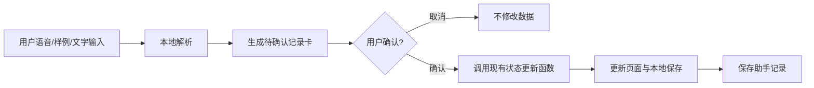

# AI 语音助手与三屏闭环工作台设计

## 背景

“药时管家”目前已经具备用药打卡、库存预警、补药采购、复诊准备和新用户指引。下一步目标是让页面更像一个面向真实慢病用户的工具：用户打开后不只是看数据，还能通过一个贯穿页面的语音助手快速记录信息。

本轮不接真实 AI 接口，也不接真实医院、药房或通知服务。语音和 AI 部分以展示型能力为主：用模拟语音样例和浏览器可用的语音输入入口，演示“说一句话，系统识别意图，用户确认后写入记录”的完整流程。

## 目标

- 把现有长页面整理成三屏闭环工作台，让“用药、补药、复诊”更清楚。
- 增加一个贯穿三屏的 AI 语音助手，用于记录服药、购药、新增药品和复诊。
- 用户输入以语音场景为主，但保留文本和模拟样例，保证评测展示稳定。
- 个人健康信息默认收起，用户主动点击后再查看，减少首页直白暴露。
- 所有新增能力继续使用本地保存，不新增后端依赖。

## 页面结构

### 第一屏：今日用药

这一屏负责回答“今天现在要做什么”。

内容包括：
- 顶部品牌和三屏导航。
- 总览数据：今日待办、已完成用药、库存风险、复诊倒计时。
- 连续服务闭环条：问诊记录、购药补药、今日用药、库存预警、复诊续方。
- 今日用药列表：按时间展示药品，支持打卡。
- AI 健康摘要：根据库存、漏服和复诊时间生成提醒。

### 第二屏：库存补药

这一屏负责回答“药够不够，什么时候买”。

内容包括：
- 药品管理。
- 补药计划。
- 补药采购清单。
- 购药记录。

### 第三屏：复诊档案

这一屏负责回答“复诊前要准备什么”。

内容包括：
- 续方准备。
- 复诊管理。
- 用药记录。
- 折叠式个人档案入口和档案面板。

## 顶部导航

顶部导航改为三段式入口：

- 今日用药
- 库存补药
- 复诊档案

点击后滚动到对应屏幕。导航只做页面定位，不改变数据状态。

## AI 语音助手

### 展示位置

AI 助手使用右下角固定入口，贯穿三屏。入口采用圆形按钮，包含麦克风或助手图标。点击后打开悬浮面板。

### 面板内容

面板内容包括：
- 标题：药时助手。
- 简短说明：可帮你记录服药、购药、新增药品和复诊。
- 麦克风按钮：尝试调用浏览器语音识别。
- 文本输入框：语音不可用时仍能输入一句话。
- 模拟语音样例按钮。
- 最近助手记录。
- 待确认记录卡。

### 模拟语音样例

默认提供以下样例：

- 我刚吃了硝苯地平
- 今天二甲双胍已经吃过了
- 我买了二甲双胍 30 片
- 帮我新增阿托伐他汀，每晚 1 片
- 下周三去华东社区医院心内科复诊

点击样例后，系统表现为“语音识别完成”，并进入本地解析流程。

### 麦克风入口

如果浏览器支持语音识别，则尝试把语音转为文本，再交给本地规则解析。

如果浏览器不支持，页面显示温和提示：

> 当前浏览器不支持语音识别，可使用示例语音或文字输入。

麦克风入口只是增强体验，不作为功能可用性的前提。

### 本地解析规则

助手识别四类意图：

1. **服药记录**
   - 示例：“我刚吃了硝苯地平”
   - 解析结果：匹配今日用药中对应药品的未完成记录。
   - 确认后：调用现有打卡逻辑，更新今日完成数和库存。

2. **购药记录**
   - 示例：“我买了二甲双胍 30 片”
   - 解析结果：匹配药品名称、数量和默认渠道“社区药房”。
   - 确认后：调用现有购药逻辑，新增购药记录并增加库存。

3. **新增药品**
   - 示例：“帮我新增阿托伐他汀，每晚 1 片”
   - 解析结果：生成药品草稿。
   - 默认字段：管理疾病为“待补充”，每日用量为 1，库存为 30，单位为“片”，服药时间为 21:00。
   - 确认后：调用现有新增药品逻辑，并生成当天用药计划。

4. **复诊安排**
   - 示例：“下周三去华东社区医院心内科复诊”
   - 解析结果：生成复诊草稿。
   - 日期解析采用固定演示规则：示例中的“下周三”按当前日期向后推到最近的下一个周三。
   - 确认后：调用现有复诊逻辑，更新下一次复诊。

### 确认写入

助手不会自动写入数据。每次解析后先生成“待确认记录卡”，内容包括：

- 识别文本。
- 识别类型。
- 即将写入的数据。
- “确认记录”按钮。
- “取消”按钮。

用户点击“确认记录”后，才真正修改本地状态。

### 助手记录

确认成功后，助手保存一条最近记录，包括：

- 时间。
- 原始识别文本。
- 操作类型。
- 操作结果说明。

最近记录保存在本地状态中，刷新后保留。

## 折叠式个人档案

### 入口

个人档案入口放在页面右上角。默认只显示“个人档案”按钮，不直接展开姓名、年龄、慢病标签等信息。

### 展开内容

点击后展开档案面板，展示：

- 姓名。
- 年龄。
- 慢病标签。
- 当前药品数量。
- 下次复诊医院和科室。
- 近 7 天用药完成率。
- 病例备注。
- 复诊摘要入口。

### 设计原则

个人健康信息默认收起，只有用户主动点击才展示。这样让页面更克制，也更符合健康管理场景中的隐私感和人文关怀。

## 数据结构

在现有状态基础上新增：

```js
assistantRecords: [
  {
    id,
    dateTime,
    transcript,
    intent,
    resultText
  }
]
```

药品、购药、复诊和用药记录仍复用现有数据结构。

## 模块设计

新增或调整模块：

- `src/lib/voiceAssistant.js`
  - 负责模拟语音样例、语音识别能力检测、本地文本解析和待确认记录生成。

- `src/components/VoiceAssistant.jsx`
  - 负责右下角助手入口、悬浮面板、样例按钮、文本输入、待确认记录卡和最近记录。

- `src/components/ProfileDrawer.jsx`
  - 负责右上角个人档案按钮和折叠面板。

- `src/components/ScreenSections.jsx`
  - 负责三屏分区结构，把现有模块按“今日用药、库存补药、复诊档案”重新组合，降低 `App.jsx` 的展示压力。

- `src/App.jsx`
  - 继续负责总状态、保存和核心事件处理。
  - 增加确认助手动作后的统一处理函数。

## 状态写入流程



## 错误与边界

- 无法识别药品名称时，提示用户换一种说法或先新增药品。
- 语音识别不可用时，不影响样例和文字输入。
- 解析出新增药品时，默认字段清楚标注“可后续编辑”。
- 复诊日期解析只覆盖演示样例，不做复杂自然语言日期系统。
- 所有医疗相关内容只作为记录和提醒，不做诊断。

## 测试计划

自动测试：
- 语音样例能解析为正确意图。
- 服药意图能匹配今日未完成记录。
- 购药意图能提取药名和数量。
- 新增药品意图能生成药品草稿。
- 复诊意图能生成复诊草稿。
- 确认助手动作后，现有状态正确变化。
- 最近助手记录能写入状态。

手动检查：
- 三屏滚动和顶部导航正常。
- AI 助手在三屏中始终可见。
- 点击模拟语音样例后出现待确认记录卡。
- 确认服药后今日用药和库存同步变化。
- 确认购药后采购清单和购药记录同步变化。
- 个人档案默认收起，点击后展开正常。
- 手机宽度下无横向滚动，助手面板不遮挡主要按钮。

## 不做的内容

- 不接真实 AI API。
- 不保存真实音频文件。
- 不接真实医院、药房、短信或通知服务。
- 不做复杂医疗诊断或治疗建议。
- 不做账号登录和云端同步。

## 验收标准

- 打开页面后能看到三屏闭环结构。
- 右下角 AI 助手能贯穿全页。
- 至少 5 个模拟语音样例可用。
- 服药、购药、新增药品、复诊四类意图都能展示解析结果。
- 所有写入必须经过用户确认。
- 刷新后新增记录和助手记录保留。
- Vercel 和 GitHub Pages 部署不受影响。
